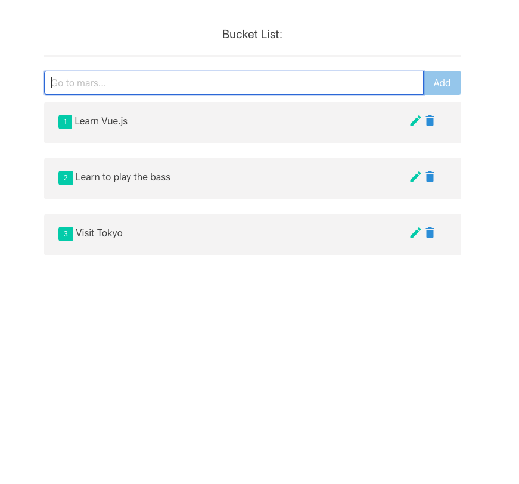

# Description
This simple app is a Bucket List for you to write down the things you want to do during this life! You can add things to your list, retrieve them from a database, update them and delete them. All the data is stored with a Cloud Database name MongoDB.

# Dev Environment

## For the Client:

### Project setup
```
npm install
```

### Compiles and hot-reloads for development
```
npm run serve
```

### Compiles and minifies for production
```
npm run build
```

### Lints and fixes files
```
npm run lint
```

## For the Server:

### Scripts for Node

Run only server:
```
node run serve
```

Run only client:
```
node run client
```

Run client and server concurrently:
```
node run dev
```

Build client:
```
node run build
```

# Screenshot


# Resources
See [Configuration Reference for Vue](https://cli.vuejs.org/config/).

See [MongoDB Documentation](https://www.mongodb.com/cloud/atlas/lp/try2?utm_source=google&utm_campaign=gs_americas_united_states_search_brand_atlas_desktop&utm_term=mongo%20db&utm_medium=cpc_paid_search&utm_ad=p&utm_ad_campaign_id=1718986498&gclid=CjwKCAjw2dD7BRASEiwAWCtCb2SbSx_CsGbu7ufsvUYJfS7NI7WuTz_IfgaLCN7bnL2kQbLq-rZqexoCNkYQAvD_BwE).

See [Mongoose Documentation](https://mongoosejs.com/docs/api.html).


