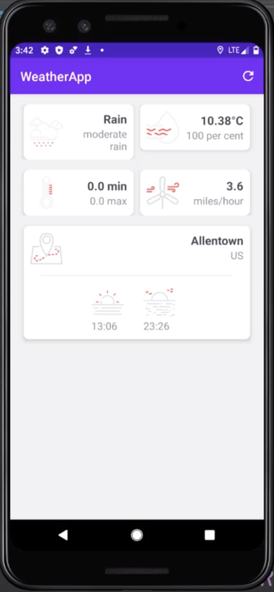

# Description
This mobile application demonstrates the use of variables, expressions, conditionals and other features in a simple weather application which consumes its data from a 3rd party API. This is a fully developed android application, using kotlin.

# Dev Environment
In order to run this type of application you need Android Studio.
The right plugings, android version and graddles will be dowloaded as soon as Android Studio detects what the app uses.

You also need an emulator, you can choose any device you'd like within android studio. This was built with a screen similar to the PIXEL 3 in mind.
 
# Run
Go to the following path WeatherApp/app/src/main/java/com/weatherapp/activities/MainActivity.kt Using the instructions from above, make sure everything has been imported and dowloaded correctly and press the play button located on the upper right corner of Android Studio.

Since I am using a free and limited API (openweathermap.org) I recommend you sign in and get your own API KEY to make sure everything runs correctly.

This will open the virtual device and emulate the app running. 
To refresh the data, click the refresh button in the upper right corner. 

# Screenshot

# Resources
How to Run your app: https://developer.android.com/training/basics/firstapp/running-app

How to Manage data in the Model: https://www.quora.com/What-is-Model-in-Android

Consuming 3rd party APIs with RETROFIT: https://guides.codepath.com/android/consuming-apis-with-retrofit
