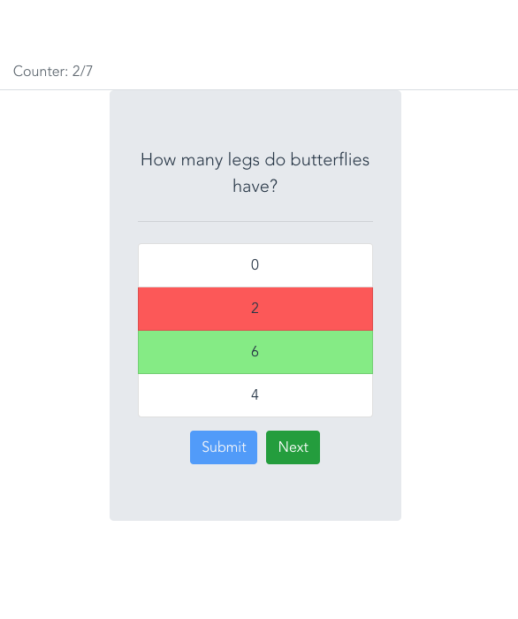

# Description
This is a Quiz Application that draws questions, wrong answers and correct answers from a third party API. It keeps track of how many questions you have answered and how many were correct. It uses Vue as a Front End Framework and the Fetch API to query the Quiz API. 

# Dev Environment setup for the CLIENT
```
npm install
```

## Compiles and hot-reloads for development
```
npm run serve
```

## Compiles and minifies for production
```
npm run build
```

## Lints and fixes files
```
npm run lint
```

## Customize configuration
See [Configuration Reference](https://cli.vuejs.org/config/).

# Screenshot


# Resources
See [Configuration Reference for Vue](https://cli.vuejs.org/config/).

See [Using the Fetch API](https://developer.mozilla.org/en-US/docs/Web/API/Fetch_API).

Why [Use Vue over other Frameworks](https://medium.com/front-end-weekly/why-choose-vue-js-over-any-other-frontend-framework-for-better-ui-16a8de5567d2).
