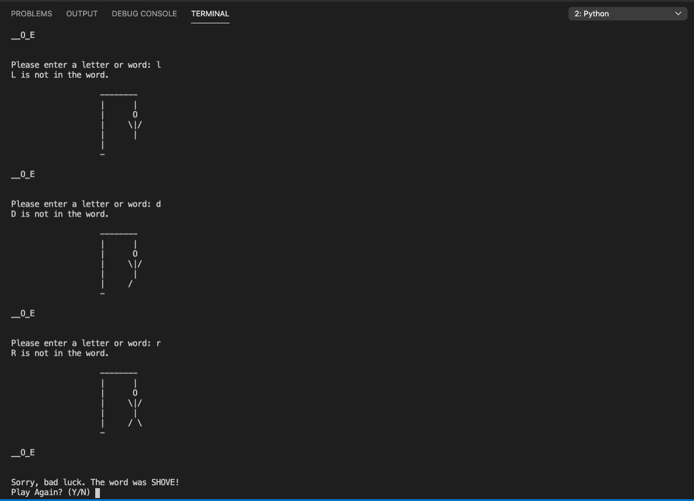

# Description
This small program demonstrates the use of variables, expressions, conditionals, loops functions and a data structure (list) in a Hangman game, using the command line to retrieve and display user input while the user tries to guess with either letters or full words.

# Dev Environment
In order to run python programs in your machine, check this useful tutorial for installing, configuring and using pythong on VSCode: https://code.visualstudio.com/docs/python/python-tutorial

If you are a Mac user, be sure to set the PATH correctly: https://code.visualstudio.com/docs/setup/mac#_launching-from-the-command-line

# Run
Using the instructions from above, make sure the interpreter is set correctly and press the play button located on the upper right corner of VSCode. Play by choosing letters or full words, you only have 6 tries! Choose if you want to keep playing or not.

# Screenshot

# Resources
What is a list in python: https://www.w3schools.com/python/python_lists.asp

Creating lists with list comprehension: https://www.pythonforbeginners.com/basics/list-comprehensions-in-python

Dealing with indentation with Python: https://www.geeksforgeeks.org/statement-indentation-and-comment-in-python/
