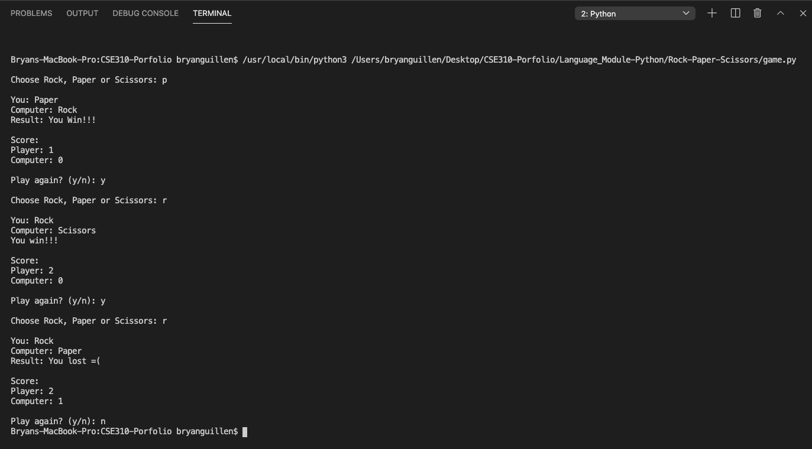

# Description
This small program demonstrates the use of variables, expressions, conditionals, loops and functions in a rock, paper, scissors game, using the command line to retrieve and display user input.

# Dev Environment
In order to run python programs in your machine, check this useful tutorial for installing, configuring and using pythong on VSCode: https://code.visualstudio.com/docs/python/python-tutorial

If you are a Mac user, be sure to set the PATH correctly: https://code.visualstudio.com/docs/setup/mac#_launching-from-the-command-line

# Run
Using the instructions from above, make sure the interpreter is set correctly and press the play button located on the upper right corner of VSCode. Play against the computer by selecting rock, paper or scissors. Choose if you want to keep playing or not.

# Screenshot

# Resources
Tutorial for Python language: https://www.w3schools.com/python/

Dealing with indentation with Python: https://www.geeksforgeeks.org/statement-indentation-and-comment-in-python/