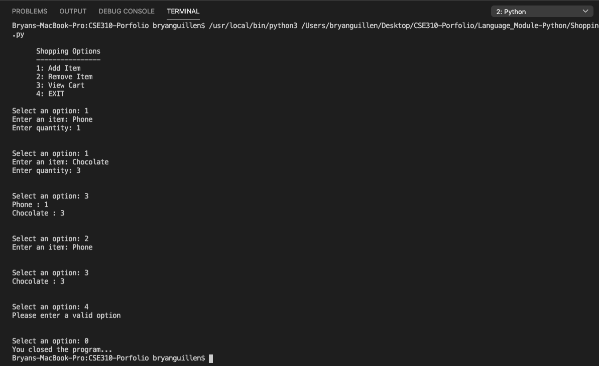

# Description
This small program demonstrates the use of a dictionary data structure with python by simulating a shopping cart with options, using the command line to retrieve and display user input while the user adds, removes or updates the items in the cart.

# Dev Environment
In order to run python programs in your machine, check this useful tutorial for installing, configuring and using pythong on VSCode: https://code.visualstudio.com/docs/python/python-tutorial

If you are a Mac user, be sure to set the PATH correctly: https://code.visualstudio.com/docs/setup/mac#_launching-from-the-command-line

# Run
Using the instructions from above, make sure the interpreter is set correctly and press the play button located on the upper right corner of VSCode. 
There are 4 different options for you to use the shopping cart. 

Enter Item and quantity to add product. Enter only item to delete, or enter new quantity to update. 

# Screenshot

# Resources
What is a dictionary: https://www.w3schools.com/python/python_dictionaries.asp

Removing items from a dictionary: https://www.geeksforgeeks.org/python-ways-to-remove-a-key-from-dictionary/

Dealing with indentation with Python: https://www.geeksforgeeks.org/statement-indentation-and-comment-in-python/