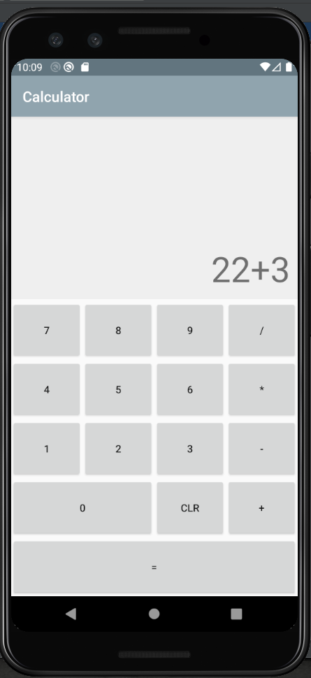

# Description
This small mobile application demonstrates the use of variables, expressions, conditionals and other features in a simple calculator app.

# Dev Environment
In order to run this type of application you need Android Studio.
The right plugings, android version and graddles will be dowloaded as soon as Android Studio detects what the app uses.

You also need an emulator, you can choose any device you'd like within android studio. This was built with a screen similar to the PIXEL 3 in mind.

# Run
Go to the following path Calculator/app/src/main/java/com/calculator/MainActivity.kt Using the instructions from above, make sure everything has been imported and dowloaded correctly and press the play button located on the upper right corner of Android Studio.

This will open the virtual device and emulate the app running. 
Use as a normal calculator. 

# Screenshot

# Resources
How to Run your app: https://developer.android.com/training/basics/firstapp/running-app

Android Layouts: https://developer.android.com/guide/topics/ui/declaring-layout