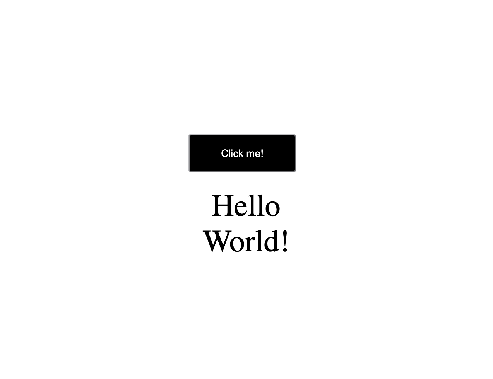

# Description
A simple Hello World program written with HTML, CSS and JavaScript.

# Environment
VSCode with Github and GIT manager pluggins.
(Check resources section to know more about installing pluggins on VSCode)

# Usage
HTML has a button linked to the onclick event, once the event is triggered it will call the script that will render the Hello World text.

# Screenshots

# Resources
How to use the onclick event: https://www.w3schools.com/jsref/event_onclick.asp